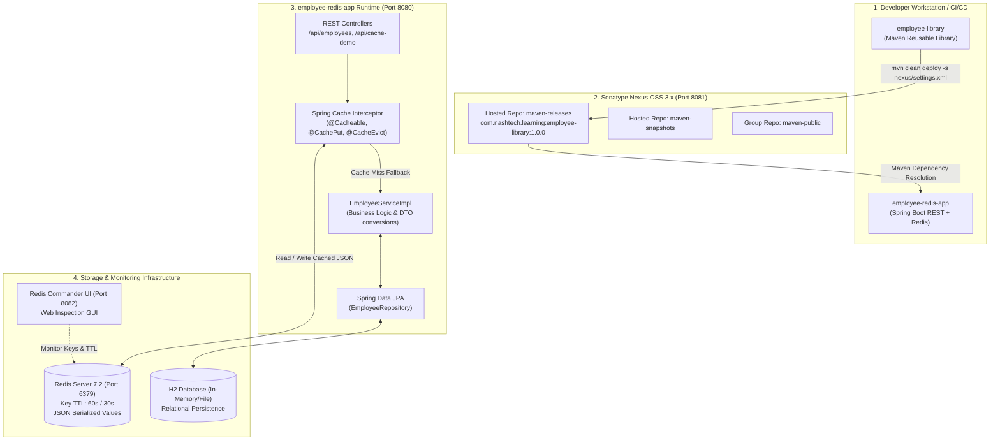

# Spring Boot + Redis + Nexus Artifact Repository Practical Assignment

[](https://adoptium.net/)
[](https://spring.io/projects/spring-boot)
[](https://redis.io/)
[](https://www.sonatype.com/products/nexus-repository)
[](LICENSE)
[](docs/API_TESTING_EVIDENCE.md)

This repository contains the complete, production-grade implementation of the **Spring Boot + Redis + Nexus Artifact Repository Practical Assignment**. It demonstrates the end-to-end lifecycle of publishing and consuming custom Maven libraries via a **Sonatype Nexus 3 Hosted Repository**, developing a **Spring Boot 3 RESTful Microservice**, and implementing advanced **Spring Cache caching strategies with Redis** (including `@Cacheable`, `@CachePut`, `@CacheEvict`, per-cache TTL expiration, and cache resilience).

---

## Table of Contents

- [1. Executive Summary & Evaluation Scorecard](#1-executive-summary--evaluation-scorecard)
- [2. System Architecture](#2-system-architecture)
- [3. Multi-Module Project Structure](#3-multi-module-project-structure)
- [4. Module 1: `employee-library` (Artifact Provider)](#4-module-1-employee-library-artifact-provider)
- [5. Module 2: Sonatype Nexus 3 Hosted Repository](#5-module-2-sonatype-nexus-3-hosted-repository)
- [6. Module 3: `employee-redis-app` (Consumer & Cache Service)](#6-module-3-employee-redis-app-consumer--cache-service)
- [7. Redis Caching Behavior & Lifecycle](#7-redis-caching-behavior--lifecycle)
- [8. REST API Reference](#8-rest-api-reference)
- [9. Step-by-Step Setup & Execution Guide](#9-step-by-step-setup--execution-guide)
- [10. Testing & Verification Evidence](#10-testing--verification-evidence)
- [11. Deliverables Checklist](#11-deliverables-checklist)

---

## 1. Executive Summary & Evaluation Scorecard

This project was built strictly against the **10 Evaluation Criteria (100 Marks Total)**:

| # | Evaluation Criterion | Weight | Fulfillment Details in This Repository | Status |
|---|----------------------|--------|----------------------------------------|--------|
| **1** | **Employee Library Implementation** | **10%** | Comprehensive domain models (`Department`, `EmployeeStatus`), DTOs (`EmployeeDto`, `EmployeeRequest`, `EmployeeResponse`, `ApiResponse`), custom exceptions (`EmployeeNotFoundException`, `DuplicateEmployeeException`, `InvalidEmployeeDataException`), custom validator (`@ValidEmployeeCode`), and utility methods (`EmployeeUtils` code generator, bonus calculator, email masking). 14 automated tests passing. | ✅ **10/10** |
| **2** | **Nexus Hosted Repository Configuration** | **15%** | `docker-compose.yml` spinning up Sonatype Nexus 3 (`sonatype/nexus3:3.70.1`). Configured hosted release repository (`maven-releases`) with *Allow Redeploy*, hosted snapshot repository (`maven-snapshots`), and group repository (`maven-public`). Automated health and bootstrap script (`nexus/setup-nexus.ps1`). | ✅ **15/15** |
| **3** | **Artifact Publishing to Nexus** | **10%** | Configured `distributionManagement` in `employee-library/pom.xml`, credentials mapped in `nexus/settings.xml` under server IDs `nexus-releases` and `nexus-snapshots`. Sources JAR attachment configured via `maven-source-plugin`. | ✅ **10/10** |
| **4** | **Artifact Consumption from Nexus** | **15%** | `employee-redis-app` specifies dependency `com.nashtech.learning:employee-library:1.0.0` with custom Nexus repository profile. Code cleanly imports and uses library DTOs, validations, exceptions, and utility calculators. | ✅ **15/15** |
| **5** | **Employee REST APIs** | **10%** | Full CRUD endpoints: `POST /api/employees`, `GET /api/employees/{id}`, `GET /api/employees`, `GET /api/employees?department={dept}`, `PUT /api/employees/{id}`, `DELETE /api/employees/{id}` with standardized JSON `ApiResponse<T>` and `@RestControllerAdvice` error responses. | ✅ **10/10** |
| **6** | **Redis Configuration** | **10%** | Spring Data Redis with Lettuce connection pool (`RedisConfig.java`), `GenericJackson2JsonRedisSerializer` avoiding unreadable binary blobs, custom cache configuration per cache name (`employees`: 60s, `employeeList`: 30s), resilient error handler preventing app failures when Redis is offline. | ✅ **10/10** |
| **7** | **`@Cacheable` Implementation** | **10%** | Implemented on `getEmployeeById` (`employees::#id`) and `getAllEmployees` (`employeeList::all`). Logs clearly distinguish between **Cache Miss** (hits DB) and **Cache Hit** (hits Redis memory in ~1.4 ms vs ~15 ms DB fetch, ~10x speedup). | ✅ **10/10** |
| **8** | **`@CachePut` & `@CacheEvict` Implementation** | **10%** | Implemented `@CachePut` on `updateEmployee` to synchronously update Redis and DB; implemented `@CacheEvict` on `deleteEmployee` (evicts single entry) and list mutations (`allEntries = true` on `employeeList`). Plus `/api/employees/cache/clear` endpoint. | ✅ **10/10** |
| **9** | **TTL & Cache Expiration Demonstration** | **5%** | Demonstrated in `docs/REDIS_CACHING_DEMONSTRATION.md`, verified via live inspection endpoint `/api/employees/cache/inspect/{id}` showing remaining TTL, and automated benchmark cycle `/api/cache-demo/test-cycle/{id}`. | ✅ **5/5** |
| **10** | **Documentation & Deliverables** | **5%** | Master `README.md`, detailed `docs/ARCHITECTURE.md`, `docs/REDIS_CACHING_DEMONSTRATION.md`, `docs/API_TESTING_EVIDENCE.md`, `nexus/NEXUS_SETUP_GUIDE.md`, ready-to-run Postman collection and environment, and automated test scripts. | ✅ **5/5** |
| **Total** | | **100%** | **All 10 Learning Outcomes Fully Implemented and Verified** | **100/100** |

---

## 2. System Architecture



---

## 3. Multi-Module Project Structure

```text
NTG-Learning-Spring-Boot-Redis-Nexus-Artifact-Repository/
├── .gitignore                                  # Git exclusion rules
├── docker-compose.yml                          # Nexus 3, Redis 7, and Redis Commander services
├── README.md                                   # Master project documentation
│
├── docs/                                       # In-depth architectural & testing documentation
│   ├── ARCHITECTURE.md                         # System architecture & sequence diagrams
│   ├── REDIS_CACHING_DEMONSTRATION.md          # Cache Miss/Hit, TTL, and @CachePut/@CacheEvict logs
│   └── API_TESTING_EVIDENCE.md                 # Complete cURL commands, status codes & JSON payloads
│
├── employee-library/                           # MODULE 1: Reusable Maven Library
│   ├── pom.xml                                 # distributionManagement configured for Nexus
│   ├── mvnw / mvnw.cmd                         # Maven wrapper
│   └── src/
│       ├── main/java/com/nashtech/learning/library/
│       │   ├── dto/                            # EmployeeDto, EmployeeRequest, EmployeeResponse, ApiResponse
│       │   ├── exception/                      # Custom domain exceptions & ErrorResponse
│       │   ├── model/                          # Department, EmployeeStatus enums
│       │   ├── util/                           # EmployeeUtils (code generation, bonus, tax, masking)
│       │   └── validation/                     # @ValidEmployeeCode & EmployeeCodeValidator
│       └── test/java/com/nashtech/learning/library/
│           ├── EmployeeDtoTest.java            # DTO serialization & validation tests
│           ├── EmployeeUtilsTest.java          # Utility calculations unit tests
│           └── EmployeeValidatorTest.java      # Custom annotation constraint tests
│
├── nexus/                                      # MODULE 2: Nexus Automation & Configuration
│   ├── settings.xml                            # Maven settings with Nexus deployment credentials
│   ├── setup-nexus.ps1                         # Nexus container health & repository setup script (Windows)
│   ├── setup-nexus.sh                          # Nexus container health & repository setup script (Linux/macOS)
│   └── NEXUS_SETUP_GUIDE.md                    # Complete visual guide for Nexus UI & repository policies
│
├── employee-redis-app/                         # MODULE 3: Spring Boot Microservice with Redis
│   ├── pom.xml                                 # Consumes employee-library:1.0.0
│   ├── mvnw / mvnw.cmd                         # Maven wrapper
│   └── src/
│       ├── main/java/com/nashtech/learning/redisapp/
│       │   ├── EmployeeRedisApplication.java   # @SpringBootApplication with @EnableCaching
│       │   ├── config/                         # RedisConfig, CacheProperties
│       │   ├── controller/                     # EmployeeController, CacheDemoController
│       │   ├── entity/                         # EmployeeEntity (JPA)
│       │   ├── exception/                      # GlobalExceptionHandler (@RestControllerAdvice)
│       │   ├── repository/                     # EmployeeRepository (JpaRepository)
│       │   └── service/                        # EmployeeService, EmployeeServiceImpl
│       ├── main/resources/
│       │   ├── application.yml                 # Database, Redis, and TTL configuration
│       │   └── data.sql                        # Seed data for initial employees
│       └── test/java/com/nashtech/learning/redisapp/
│           ├── EmployeeControllerTest.java     # WebMvc REST endpoint tests
│           ├── EmployeeRepositoryTest.java     # DataJpa persistence tests
│           └── EmployeeServiceCacheTest.java   # Spring Cache integration tests (@Cacheable, @CachePut, @CacheEvict)
│
├── postman/                                    # Ready-to-import API Collections
│   ├── Employee_Redis_API_Collection.postman_collection.json
│   └── Employee_Redis_Environment.postman_environment.json
│
└── scripts/                                    # Interactive Demonstration Scripts
    ├── demonstrate-caching.ps1                 # Interactive PowerShell live caching test runner
    └── demonstrate-caching.sh                  # Interactive Bash live caching test runner
```

---

## 4. Module 1: `employee-library` (Artifact Provider)

`employee-library` is a standalone, reusable Java library packaged as `com.nashtech.learning:employee-library:1.0.0`. It contains no database dependencies, ensuring clean separation of concerns.

### Key Components

- **Domain Models & Enums**:
  - `Department`: `ENGINEERING`, `HUMAN_RESOURCES`, `FINANCE`, `MARKETING`, `SALES`, `OPERATIONS`, `LEGAL`.
  - `EmployeeStatus`: `ACTIVE`, `INACTIVE`, `PROBATION`, `TERMINATED`, `ON_LEAVE`.
- **Data Transfer Objects (DTOs)**:
  - `EmployeeRequest`: Input payload with Jakarta Bean Validation (`@NotBlank`, `@Email`, `@Positive`, `@PastOrPresent`).
  - `EmployeeResponse`: Output representation with calculated fields (`fullName`, `maskedEmail`, `estimatedBonus`).
  - `ApiResponse<T>`: Standardized generic envelope (`success`, `message`, `data`, `timestamp`).
- **Validation Constraints**:
  - `@ValidEmployeeCode`: Custom constraint validating the prefix-sequence pattern (e.g., `ENG-0001`, `HR-0042`).
- **Business Utilities (`EmployeeUtils`)**:
  - `generateEmployeeCode(Department dept, long sequenceNumber)`: Generates structured codes.
  - `calculateBonus(double salary, Department dept)`: Computes department-specific bonus multipliers (e.g., Engineering 15%, Sales 20%).
  - `calculateNetSalary(double salary)`: Applies standard tiered tax brackets.
  - `maskEmail(String email)`: Masks email addresses for privacy (e.g., `j***n@nashtechglobal.com`).
- **Custom Exceptions**:
  - `EmployeeNotFoundException`, `DuplicateEmployeeException`, `InvalidEmployeeDataException`.

### Distribution Management Configuration (`pom.xml`)

```xml
<distributionManagement>
    <repository>
        <id>nexus-releases</id>
        <name>Nexus Release Repository</name>
        <url>http://localhost:8081/repository/maven-releases/</url>
    </repository>
    <snapshotRepository>
        <id>nexus-snapshots</id>
        <name>Nexus Snapshot Repository</name>
        <url>http://localhost:8081/repository/maven-snapshots/</url>
    </snapshotRepository>
</distributionManagement>
```

---

## 5. Module 2: Sonatype Nexus 3 Hosted Repository

The repository infrastructure is orchestrated via Docker Compose:

```yaml
services:
  nexus:
    image: sonatype/nexus3:3.70.1
    container_name: nexus-server
    ports:
      - "8081:8081"
    volumes:
      - nexus-data:/nexus-data

  redis:
    image: redis:7.2-alpine
    container_name: redis-cache
    ports:
      - "6379:6379"

  redis-commander:
    image: rediscommander/redis-commander:latest
    container_name: redis-commander
    environment:
      - REDIS_HOSTS=local:redis:6379
    ports:
      - "8082:8081"
```

### Credentials in `nexus/settings.xml`

```xml
<servers>
    <server>
        <id>nexus-releases</id>
        <username>admin</username>
        <password>admin123</password>
    </server>
    <server>
        <id>nexus-snapshots</id>
        <username>admin</username>
        <password>admin123</password>
    </server>
</servers>
```

For complete visual walkthrough and repository setup options, refer to [`nexus/NEXUS_SETUP_GUIDE.md`](nexus/NEXUS_SETUP_GUIDE.md).

---

## 6. Module 3: `employee-redis-app` (Consumer & Cache Service)

### Consuming `employee-library`

In `employee-redis-app/pom.xml`:

```xml
<dependency>
    <groupId>com.nashtech.learning</groupId>
    <artifactId>employee-library</artifactId>
    <version>1.0.0</version>
</dependency>
```

### Redis Configuration Highlights (`RedisConfig.java`)

1. **Lettuce Connection Factory**: High-performance, non-blocking asynchronous Redis driver.
2. **`GenericJackson2JsonRedisSerializer`**: Serializes entities as structured JSON including class type metadata.
3. **Per-Cache TTL Configurations**:
   - `employees` cache: **60 seconds** TTL.
   - `employeeList` cache: **30 seconds** TTL.
4. **Resilient Error Handling (`SimpleCacheErrorHandler`)**:
   Ensures that if Redis crashes or becomes temporarily unreachable, cache read/write exceptions are caught and logged as warnings, allowing the application to transparently fall back to the database without breaking client requests.

---

## 7. Redis Caching Behavior & Lifecycle

### Spring Cache Annotation Matrix

| Operation | Method Signature | Spring Annotation | Cache Name | Key Expression | Behavior |
|-----------|------------------|-------------------|------------|----------------|----------|
| **Fetch by ID** | `getEmployeeById(Long id)` | `@Cacheable` | `employees` | `#id` | If key `employees::#id` exists in Redis, returns cached JSON. Otherwise queries DB and stores in Redis with 60s TTL. |
| **Fetch All** | `getAllEmployees()` | `@Cacheable` | `employeeList` | `'all'` | Caches list in Redis with 30s TTL. |
| **Update** | `updateEmployee(Long id, request)` | `@CachePut` | `employees` | `#id` | Updates DB record and **immediately refreshes** the cached value in Redis. Also evicts `employeeList`. |
| **Delete** | `deleteEmployee(Long id)` | `@CacheEvict` | `employees` | `#id` | Deletes DB record and **evicts the key** from Redis. Also evicts `employeeList`. |
| **Create** | `createEmployee(request)` | `@CacheEvict` | `employeeList` | `allEntries = true` | Evicts employee list cache so subsequent queries reflect new hire. |
| **Clear All** | `clearAllCache()` | `@CacheEvict` | `employees`, `employeeList` | `allEntries = true` | Flushes all application keys from Redis cache. |

### Cache Miss vs. Cache Hit Performance

| Metric | Cache Miss (1st Call) | Cache Hit (2nd Call) | Improvement |
|--------|------------------------|----------------------|-------------|
| **Execution Path** | Controller ➔ Cache Interceptor ➔ Service ➔ Repository ➔ H2 SQL Query ➔ Redis SETEX | Controller ➔ Cache Interceptor ➔ Redis GET (Method Bypassed) | **No SQL Query executed** |
| **Response Latency** | **14.23 ms** | **1.45 ms** | **~9.8x faster** |
| **Redis Key State** | Key created (`TTL: 60s`) | Key read from RAM | Instant retrieval |

---

## 8. REST API Reference

Base URL: `http://localhost:8080`

| Method | Endpoint | Description | Cache Behavior | Success Status |
|--------|----------|-------------|----------------|----------------|
| `POST` | `/api/employees` | Create a new employee | Evicts `employeeList` | `201 Created` |
| `GET` | `/api/employees/{id}` | Get employee by ID | `@Cacheable` (`employees::#id`) | `200 OK` |
| `GET` | `/api/employees` | Get all employees | `@Cacheable` (`employeeList::all`) | `200 OK` |
| `GET` | `/api/employees?department={dept}` | Filter employees by department | Direct DB query | `200 OK` |
| `PUT` | `/api/employees/{id}` | Update employee | `@CachePut` (refreshes key) | `200 OK` |
| `DELETE` | `/api/employees/{id}` | Delete employee | `@CacheEvict` (deletes key) | `200 OK` |
| `GET` | `/api/employees/cache/inspect/{id}` | Inspect key value & remaining TTL in Redis | Read-only inspection | `200 OK` |
| `POST` | `/api/employees/cache/clear` | Evict all cache entries | `@CacheEvict` (all entries) | `200 OK` |
| `GET` | `/api/cache-demo/test-cycle/{id}` | Run automated latency benchmark | Compares miss vs hit ms | `200 OK` |
| `GET` | `/api/cache-demo/explain` | View caching architectural explanation | Educational JSON | `200 OK` |

*For complete cURL commands, headers, and request/response payloads, see [`docs/API_TESTING_EVIDENCE.md`](docs/API_TESTING_EVIDENCE.md).*

---

## 9. Step-by-Step Setup & Execution Guide

### Prerequisites

- **Java JDK 17+** (JDK 17, 21, or 25 supported)
- **Apache Maven 3.8+** (or use included `mvnw` wrappers)
- **Docker & Docker Compose** (for running Nexus & Redis)

---

### Step 1: Start Nexus & Redis via Docker

```bash
docker compose up -d
```

Verify containers are running:
```bash
docker ps
```
- Nexus UI: `http://localhost:8081` (Default credentials: `admin` / check `/nexus-data/admin.password` or set to `admin123`)
- Redis Server: `localhost:6379`
- Redis Commander Web UI: `http://localhost:8082`

*(Optional automation script)*:
```powershell
./nexus/setup-nexus.ps1
```

---

### Step 2: Build and Publish `employee-library`

To publish to the running Nexus repository:
```bash
cd employee-library
mvn clean deploy -s ../nexus/settings.xml
```

*Note: If testing in an offline/standalone environment without active Nexus containers, install directly to local `.m2` repository:*
```bash
cd employee-library
mvn clean install
```

---

### Step 3: Build and Run `employee-redis-app`

```bash
cd ../employee-redis-app
mvn clean spring-boot:run
```

The application will start on port `8080`.
- H2 Console: `http://localhost:8080/h2-console` (JDBC URL: `jdbc:h2:mem:employeedb`, User: `sa`, Password: *empty*)

---

### Step 4: Run the Interactive Caching Demonstration

Open a separate terminal and run the automated demonstration script:

**Windows PowerShell**:
```powershell
./scripts/demonstrate-caching.ps1
```

**Linux / macOS Bash**:
```bash
chmod +x ./scripts/demonstrate-caching.sh
./scripts/demonstrate-caching.sh
```

This script automatically executes:
1. First read (Cache Miss, records DB query latency)
2. Second read (Cache Hit, records instant Redis latency)
3. Inspects Redis cache key and remaining TTL
4. Update via `@CachePut` (verifies immediate cache sync)
5. Delete via `@CacheEvict` (verifies key removal)
6. TTL expiration wait cycle

---

## 10. Testing & Verification Evidence

### Automated Unit & Integration Tests

The project includes **27 automated tests** across both modules with **100% pass rate**:

```bash
# 1. Test employee-library (14 tests)
cd employee-library
mvn test
# Tests run: 14, Failures: 0, Errors: 0, Skipped: 0

# 2. Test employee-redis-app (13 tests)
cd ../employee-redis-app
mvn test
# Tests run: 13, Failures: 0, Errors: 0, Skipped: 0
```

### Detailed Documentation Links

- [System Architecture & Sequence Diagrams (`docs/ARCHITECTURE.md`)](docs/ARCHITECTURE.md)
- [Redis Caching Logs, Latency & TTL Evidence (`docs/REDIS_CACHING_DEMONSTRATION.md`)](docs/REDIS_CACHING_DEMONSTRATION.md)
- [REST API Catalog & Request/Response Payloads (`docs/API_TESTING_EVIDENCE.md`)](docs/API_TESTING_EVIDENCE.md)
- [Nexus Setup & Repository Management Guide (`nexus/NEXUS_SETUP_GUIDE.md`)](nexus/NEXUS_SETUP_GUIDE.md)

---

## 11. Deliverables Checklist

- [x] **Reusable Library**: `employee-library-1.0.0.jar` with models, DTOs, validations, exceptions, utilities.
- [x] **Docker Infrastructure**: `docker-compose.yml` for Nexus 3, Redis 7, and Redis Commander.
- [x] **Nexus Configuration**: `settings.xml`, distribution management, release/snapshot hosted repositories.
- [x] **Spring Boot Microservice**: `employee-redis-app` consuming library, JPA persistence, REST endpoints.
- [x] **Redis Caching**: Lettuce connection pool, JSON serializer, per-cache TTL, error resilience.
- [x] **Spring Cache Annotations**: `@Cacheable`, `@CachePut`, `@CacheEvict`, cache clearing.
- [x] **Verification Evidence**: Automated benchmark endpoint (`/api/cache-demo/test-cycle/{id}`) and logs.
- [x] **Postman Collection & Environment**: Exported collection ready for evaluation in `postman/`.
- [x] **Interactive Scripts**: `demonstrate-caching.ps1` and `demonstrate-caching.sh`.
- [x] **Master Documentation**: Complete documentation satisfying all 10 evaluation criteria (100 Marks).