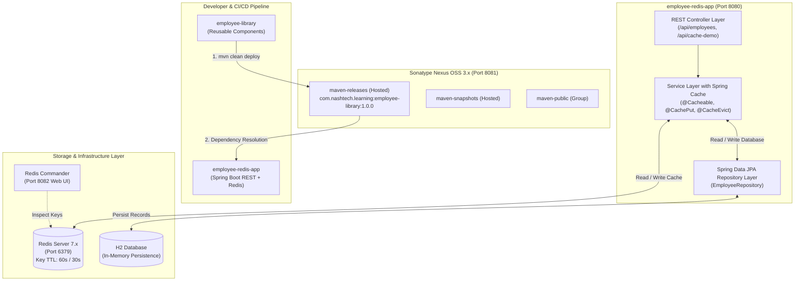
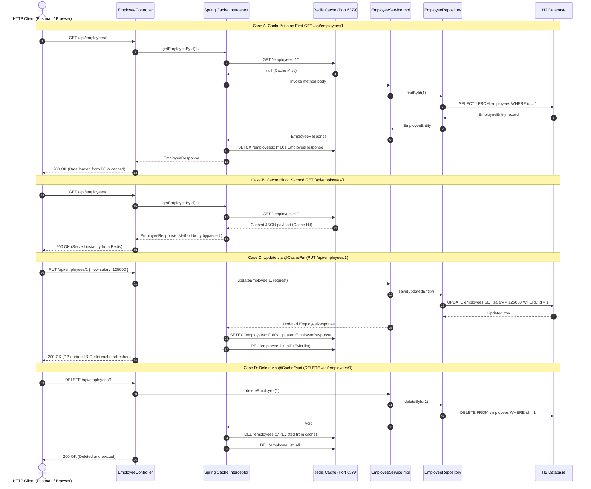

# System Architecture & Technical Design

This document details the architectural design of the end-to-end multi-module solution comprising **`employee-library`**, **Sonatype Nexus 3 Hosted Repository**, **`employee-redis-app`**, **Spring Cache with Redis**, and **Database Persistence**.

---

## 1. High-Level System Architecture

---

## 2. Module Breakdown

### Module 1: `employee-library`
- **Purpose**: Encapsulates reusable employee domain models, DTOs, validations, custom exceptions, and utilities.
- **Maven Coordinates**: `com.nashtech.learning:employee-library:1.0.0`
- **Key Responsibilities**:
  - `Department` & `EmployeeStatus` enums.
  - `EmployeeDto`, `EmployeeRequest`, `EmployeeResponse`, `ApiResponse<T>` DTOs.
  - `EmployeeNotFoundException`, `DuplicateEmployeeException`, `InvalidEmployeeDataException`.
  - `EmployeeUtils` (salary bonus calculation, tax deductions, employee code generator `ENG-0001`, email masking).
  - Jakarta Bean Validation constraints (`@ValidEmployeeCode`).
  - Distribution management configured for Nexus hosted releases and snapshots.

### Module 2: Sonatype Nexus 3 Hosted Repository
- **Purpose**: Enterprise artifact repository manager hosting internal company Maven artifacts.
- **Configuration**:
  - Hosted Repository: `maven-releases` (Release Version Policy, Allow Redeploy).
  - Snapshot Repository: `maven-snapshots`.
  - Authentication: Deployment credentials mapped via `settings.xml`.

### Module 3: `employee-redis-app`
- **Purpose**: Spring Boot 3 RESTful microservice consuming `employee-library`, persisting data to database, and utilizing Redis as a cache.
- **Key Responsibilities**:
  - Consumes `employee-library` directly from Nexus.
  - Exposes RESTful CRUD endpoints on `/api/employees`.
  - Spring Data JPA with H2 database (`/h2-console`).
  - Spring Cache abstraction integrated with Lettuce Redis connection pool.
  - Granular Cache management and TTL expiration policies.
  - Comprehensive global exception handling (`@RestControllerAdvice`).

---

## 3. Redis Caching Workflow

---

## 4. Key Design Decisions

1. **JSON Serialization in Redis (`GenericJackson2JsonRedisSerializer`)**:
   Instead of default JDK binary serialization (which is unreadable in Redis CLI and sensitive to JVM class changes), all cached values are stored as human-readable JSON with type headers and ISO-8601 timestamps.
2. **Per-Cache TTL Policies**:
   - `employees` cache: 60 seconds TTL (configurable via `app.cache.employee-ttl-seconds`).
   - `employeeList` cache: 30 seconds TTL (configurable via `app.cache.list-ttl-seconds`).
3. **Resilient Cache Error Handler**:
   If Redis becomes temporarily unavailable, the `SimpleCacheErrorHandler` catches the error, logs a warning, and falls back to querying the database directly rather than failing the client request.