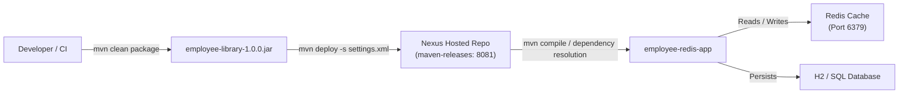

# Nexus Hosted Maven Repository Configuration & Deployment Guide

This guide walks through configuring Sonatype Nexus 3, publishing the `employee-library` Maven artifact, and consuming it in `employee-redis-app`.

---

## 1. Architecture & Flow



---

## 2. Starting Nexus with Docker

Run the included `docker-compose.yml` to launch Nexus 3, Redis 7, and Redis Commander:

```bash
docker compose up -d
```

Check the startup status of Nexus:
```bash
docker compose ps
# Wait until ntg-nexus status is Healthy/Up (typically takes ~60-90 seconds on first start)
docker compose logs -f nexus
```

Once started, Nexus 3 Web UI is accessible at:
👉 **`http://localhost:8081`**

---

## 3. First-Time Nexus Authentication & Password Setup

On initial startup, Nexus generates a random admin password in the container:

### On Windows PowerShell:
```powershell
docker exec ntg-nexus cat /nexus-data/admin.password
```

### On Linux / macOS:
```bash
docker exec -it ntg-nexus cat /nexus-data/admin.password
```

1. Open **`http://localhost:8081`** in your browser.
2. Click **Sign In** in the top right corner.
3. Username: `admin`
4. Password: `<paste password from command above>`
5. Follow the setup wizard:
   - Set a new password (e.g., `admin123`).
   - Configure **Anonymous Access**: Select **Enable anonymous access** (allows read-only consumption without credentials) or disable it if you prefer strict authentication.
   - Click **Finish**.

---

## 4. Nexus Hosted Repository Verification

Sonatype Nexus 3 comes out of the box with the following Maven repositories:

| Repository Name | Type | Format | URL | Purpose |
|-----------------|------|--------|-----|---------|
| `maven-releases` | **Hosted** | maven2 | `http://localhost:8081/repository/maven-releases/` | Stores release versions (e.g. `1.0.0`) |
| `maven-snapshots` | **Hosted** | maven2 | `http://localhost:8081/repository/maven-snapshots/` | Stores development snapshots (e.g. `1.0.0-SNAPSHOT`) |
| `maven-central` | **Proxy** | maven2 | `http://localhost:8081/repository/maven-central/` | Proxies maven central |
| `maven-public` | **Group** | maven2 | `http://localhost:8081/repository/maven-public/` | Aggregates releases, snapshots, and central |

### Recommended Setting for Hosted Release Deployment:
1. Go to **Server Admin and Configuration (gear icon)** -> **Repositories** -> **`maven-releases`**.
2. Under **Hosted**, verify:
   - **Version policy**: `Release`
   - **Deployment policy**: `Allow redeploy` (useful for development/testing so you can re-deploy version `1.0.0` if needed).
3. Click **Save**.

---

## 5. Configuring Maven `settings.xml`

Maven needs credentials to deploy to Nexus hosted repositories. The project includes a pre-configured `nexus/settings.xml`:

```xml
<servers>
    <server>
        <id>nexus-releases</id>
        <username>admin</username>
        <password>admin123</password>
    </server>
    <server>
        <id>nexus-snapshots</id>
        <username>admin</username>
        <password>admin123</password>
    </server>
</servers>
```

You can pass environment variables or override directly:
```powershell
$env:NEXUS_USERNAME="admin"
$env:NEXUS_PASSWORD="admin123"
```

---

## 6. Publishing `employee-library` to Nexus

In `employee-library/pom.xml`, the distribution management is defined:

```xml
<distributionManagement>
    <repository>
        <id>nexus-releases</id>
        <name>Nexus Hosted Release Repository</name>
        <url>http://localhost:8081/repository/maven-releases/</url>
    </repository>
    <snapshotRepository>
        <id>nexus-snapshots</id>
        <name>Nexus Hosted Snapshot Repository</name>
        <url>http://localhost:8081/repository/maven-snapshots/</url>
    </snapshotRepository>
</distributionManagement>
```

Execute the Maven deploy command pointing to `nexus/settings.xml`:

```bash
cd employee-library
mvn clean deploy -s ../nexus/settings.xml
```

Expected Maven Output:
```text
[INFO] --- deploy:3.1.2:deploy (default-deploy) @ employee-library ---
Uploading to nexus-releases: http://localhost:8081/repository/maven-releases/com/nashtech/learning/employee-library/1.0.0/employee-library-1.0.0.jar
Uploaded to nexus-releases: http://localhost:8081/repository/maven-releases/com/nashtech/learning/employee-library/1.0.0/employee-library-1.0.0.jar (18 kB at 145 kB/s)
Uploading to nexus-releases: http://localhost:8081/repository/maven-releases/com/nashtech/learning/employee-library/1.0.0/employee-library-1.0.0.pom
Uploaded to nexus-releases: http://localhost:8081/repository/maven-releases/com/nashtech/learning/employee-library/1.0.0/employee-library-1.0.0.pom (3.2 kB at 34 kB/s)
[INFO] BUILD SUCCESS
```

---

## 7. Verifying Published Artifact in Nexus UI

1. Open **`http://localhost:8081`**.
2. Click on **Browse** (cube icon) -> **Browse** -> **`maven-releases`**.
3. Expand tree:
   - `com`
     - `nashtech`
       - `learning`
         - `employee-library`
           - `1.0.0`
             - `employee-library-1.0.0.jar`
             - `employee-library-1.0.0.pom`
             - `employee-library-1.0.0-sources.jar`

---

## 8. Consuming the Artifact in `employee-redis-app`

In `employee-redis-app/pom.xml`, the Nexus repository and the dependency are declared:

```xml
<dependencies>
    <!-- Reusable library artifact published to Nexus -->
    <dependency>
        <groupId>com.nashtech.learning</groupId>
        <artifactId>employee-library</artifactId>
        <version>1.0.0</version>
    </dependency>
</dependencies>

<repositories>
    <repository>
        <id>nexus-releases</id>
        <name>Nexus Hosted Releases</name>
        <url>http://localhost:8081/repository/maven-releases/</url>
        <releases>
            <enabled>true</enabled>
        </releases>
        <snapshots>
            <enabled>false</enabled>
        </snapshots>
    </repository>
</repositories>
```

Build and run `employee-redis-app`:
```bash
cd employee-redis-app
mvn clean package -s ../nexus/settings.xml
mvn spring-boot:run
```
